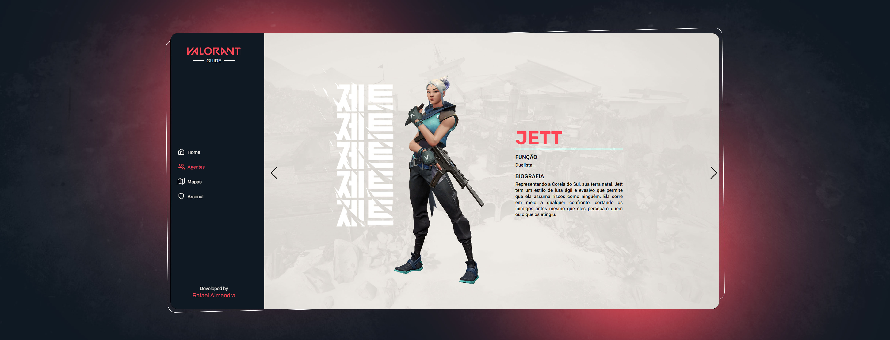

<p align="center" >
  
</p>

<p align="center" >
  
</p>

<p align="center">
  <a href="https://valorant-guide-app.netlify.app/" target="_blank">
    🌐 click here to access the deploy
  </a>
</p>

<p align="center">
  <a href="https://www.figma.com/file/nfxauBSKHqdOmE3WIoVKic/Valorant-Guide?node-id=1%3A4" target="_blank">
    🖌️ click here to access the Figma
  </a>
</p>

## 💻 Project

Valorant Guide is intended to show valorant information interactively for novice players.

<br>

## 🧪 Technologies

- Nextjs
- Styled Components
- Typescript
- Axios
- Valorant API

<br>

## 🚀 How to run

To start it, follow the steps below:

```bash
# Install dependencies
$ yarn

# Start the project
$ yarn dev
```

<br>

Made with 💜 by Rafael Almendra 👋 [See my linkedin](https://www.linkedin.com/in/rafaelalmendraa/)
